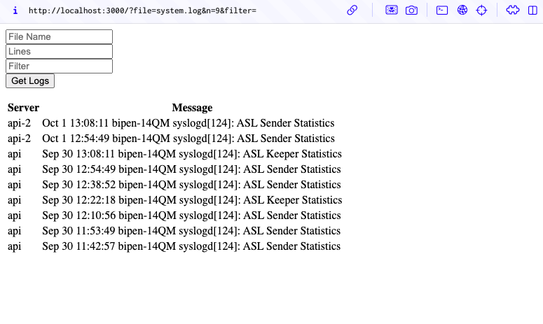

# Log Collection Service

A service that reads the `/var/log/` folder in the server and returns logs in a structured format. If a filename is not provided, it will default to reading from the `system.log` file.

It also supports requesting logs from additional secondary servers. The list of secondary servers can be specified via the environment variable PEERS.

## API

- Endpoint: `/api/v1/logs` 
- Parameters:
  - n: number of log entries to retrieve
  - file: name of log file
  - filter: basic keyword match filter

Example curl command:

```
curl 'localhost:3000/api/v1/logs?n=10&file=wifi.log&filter=notification'
```

## Local development

- Install Docker
- Run Docker compose using Makefile to start a setup that has 1 primary server and 2 secondary servers
  ```
    make run
  ```
- Run Tests using Makefile:
  ```
    make test
  ```
- Launch UI Demo at `localhost:3000`

## Feature List

- Read logs from single server [DONE]
- Get last n entries [DONE]
- Filter by query string [DONE]
- Secondary Servers:
  - fetch logs from secondary servers [DONE]
  - parse timestamp of each entry [DONE]
  - merge with primary server [DONE]
- Add Tests [DONE]
- Add documentation [DONE]
- Add a basic UI [DONE]

### Screenshot of Basic UI Demo

